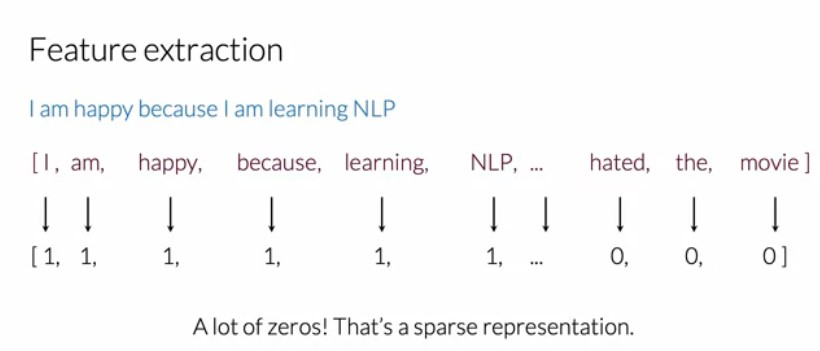
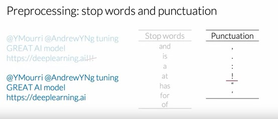

## Week 1 - Sentiment Analysis using Logistic Regression

### Supervised ML and Sentiment Analysis

- **Supervised ML** mostly involves having a set of features X and set of labels Y, and calculating the predicted output Y' by using some parameters O. The goal is to minimize a loss function in order to close the gap between Y and Y'.

  

- The primary objective of basic **Sentiment Analysis** is to find if the sentiment is positive or negative. We start with a training set of positive and negative tweets with a label of 1 or 0 for positive and negative respectively.

  

- But to perform this process, it is important to extract these features in a form that the computer can understand. This is commonly done in the form of vectors which are discussed in the next sections.

---

### Vocabulary and Feature Extraction

- For converting the given text into a vector, it is important to build a vocabulary which allows us to encode the given text (a tweet in this case) as an array of numbers.
- To build this vocabulary, we go through all the given text and make a list of the unique words we encounter.

  

- Feature Extraction is the process of converting each text into it's vector representation. We simply do this by having the whole copy of the vocabulary array with 1's and 0's whenever the words occur in the actual sentence.

  

- The problem with this representation arises when there are a large number of unique words in the vocabulary. This leads to a lot of 0's in the vector representation which is also known as sparse representation.
- This sparse representation would have a number of features which is equal to the size of the entire vocabulary. A supervised learning model like Logistic Regression would have to learn n+1 parameters for each tweet where n is the size of the vocabulary, which would be problematic in cases of large vocabulary sizes.
- This leads to larger training times thereby delaying the predictions.

  

---

### Positive and Negative Frequencies

- Positive and Negative word count can be used for a simple logistic regression classifier.
- Word frequency is basically a dictionary mapping of a unique word in the corpus and the frequency where the words are used in a positive way or negative way. (correspoding classes if multiple sentiments)

  
  

### Feature Extraction with Frequencies

- Instead of encoding a text in V dimensions (sparse representation), we can encode the word in 3 dimensions, which improves our training and prediction time.

  

- The features are the cumulative sum of the positive and negative words, with no duplicates.

  

### Preprocessing

- **Removing Stopwords** is one of the initial steps of preprocessing a text. Removing punctuation marks are also neccessary.
- Stop words are those words which do not add significant meaning to the text. The efficient way to remove stop words is to compare this text with a list of stop words.

  

- Next step is to remove **social media handles/tags** and **URLs**

  

- The final steps include **Stemming** and **Lowercasing**. Stemming is the process of getting the root word of the specific word. Stemming and Lowercasing helps us in maintaining uniformity among different variants of the same word, therefore reducing the dimensionality of the vocabulary of unique words.

  

### Logistic Regression
