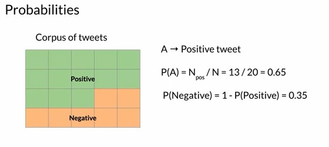
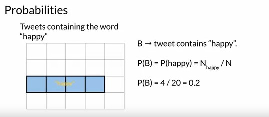
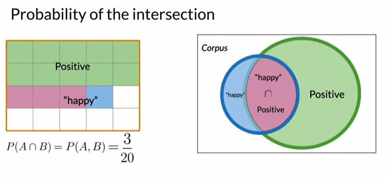
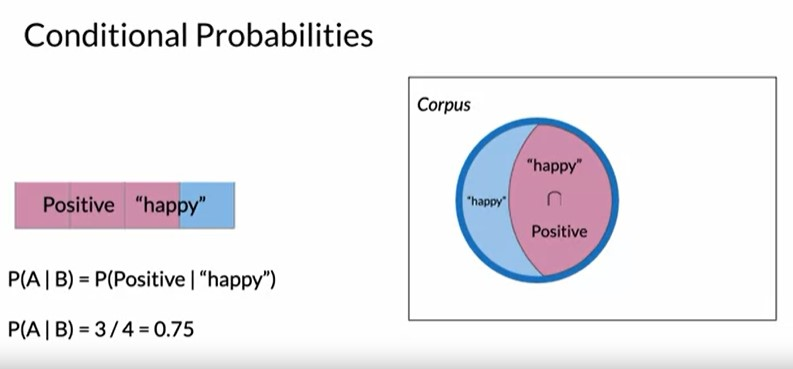
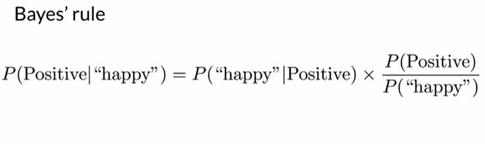
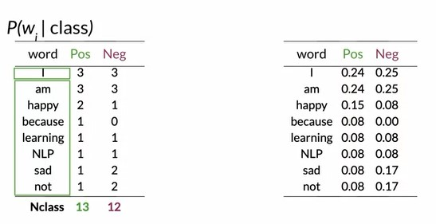
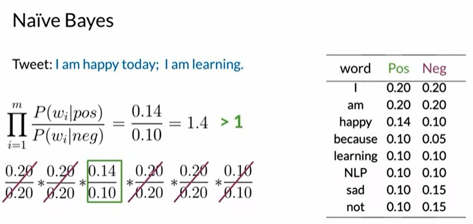

## Week 2 - Sentiment Analysis using Naive Bayes Classification

### Probability and Bayes Rule

- Consider having an extensive corpus of tweets (similar to the previous sections) with clearly demarcated positive and negative tweets.
- If a word (eg. Happy) is used in both positive and negative sentiment, it is better to visusalise this in terms of probability.

  
  
  

---

### Conditional Probabilities and Bayes Rule

- Conditional Probabilities can be defined as the probability of an event A occuring given that another event B has already occured.
- Here in our case we can consider the probability that the tweeet is positive given that the tweet contains "happy". i.e. **P (A | B) = P (A & B) / P (B)**

  

- Bayes rule can be derived from the previous equation i.e. **P (A | B)= P (B | A)\* P (A) / P (B)**

  

---

### Naive Bayes

- Naive Bayes is a supervised machine learning algorithm, which is often used as a quick baseline for classification tasks.
- It is called "Naive" because it assumes that all the features used for the classification are independent.
- The first step of the classification process is similar to the previous method. We extract the count of the words used in their positive and negative sense.
- The second step is to divide this counts with the total number of positive and total number of negative words respectively, to get the individual conditional probabilities.

  

- If the positive and negative conditional probabilities are **closer, they do not play a major role** in the sentiment of the sentence.
- If the positive and negative conditional probabilities have **significant difference, they play a major role in the sentiment of the sentence.**
- Words with zero in their conditional probability will cause the system to fail, therefore a smoothing system is required i.e. a small margin is added to all the conditional probabilties.

  
