## Week 2 - Sentiment Analysis using Naive Bayes Classification

### Probability and Bayes Rule

- Consider having an extensive corpus of tweets (similar to the previous sections) with clearly demarcated positive and negative tweets.
- If a word (eg. Happy) is used in both positive and negative sentiment, it is better to visusalise this in terms of probability.

  
  
  

---

### Conditional Probabilities and Bayes Rule

- Conditional Probabilities can be defined as the probability of an event A occuring given that another event B has already occured.
- Here in our case we can consider the probability that the tweeet is positive given that the tweet contains "happy". i.e. **P (A | B) = P (A & B) / P (B)**

  

- Bayes rule can be derived from the previous equation i.e. **P (A | B)= P (B | A)\* P (A) / P (B)**

  

---

### Naive Bayes

- Naive Bayes is a supervised machine learning algorithm, which is often used as a quick baseline for classification tasks.
- It is called "Naive" because it assumes that all the features used for the classification are independent.
- The first step of the classification process is similar to the previous method. We extract the count of the words used in their positive and negative sense.
- The second step is to divide this counts with the total number of positive and total number of negative words respectively, to get the individual conditional probabilities.

  

- If the positive and negative conditional probabilities are **closer, they do not play a major role** in the sentiment of the sentence.
- If the positive and negative conditional probabilities have **significant difference, they play a major role in the sentiment of the sentence.**
- Words with zero in their conditional probability will cause the system to fail, therefore a smoothing system is required i.e. a small margin is added to all the conditional probabilties.

  

- The final product using the formula gives us the probability which is above 1 thereby classifying the tweet as positive.

---

### Laplacian Smoothing

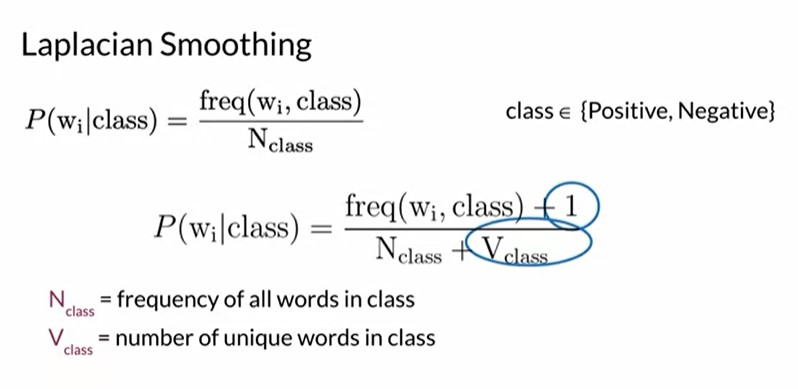
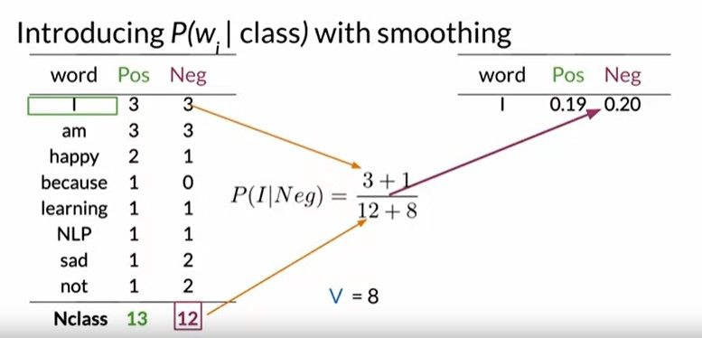

---

### Log Likelihood

- As discussed in the previos section, the ratio of the probabilities gives us the importance of the word in deciding the sentiment of the sentence. Those with ratio of 1 i.e **P (W|Pos) / P( W|Neg)** = 1 do not play any major role in deciding the sentiment of the sentence, and they are neutral words.

  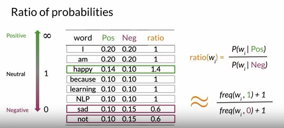

- The actual Naive Bayes Rule consists an extra parameter which is known as the **prior ratio**. Prior Ratio is defined by the formula -> P(Pos)/P(Neg).

  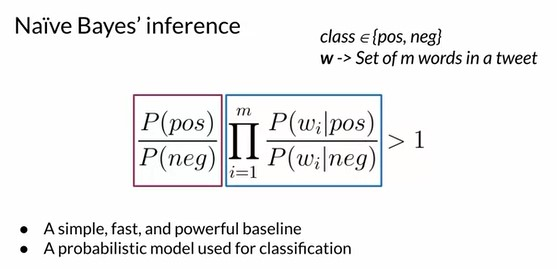

- But when we start to multiply these smaller ratios, they result in a very small product i.e. products bring risk of underflow.
- To avoid this situation, we use logarithms for performing these operations.

  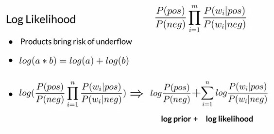
  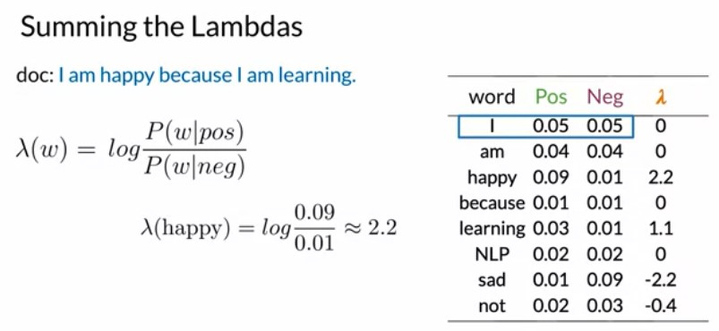
  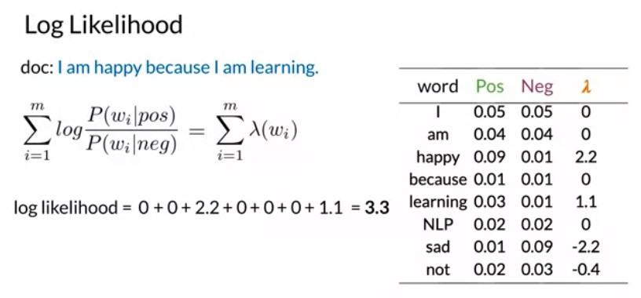
  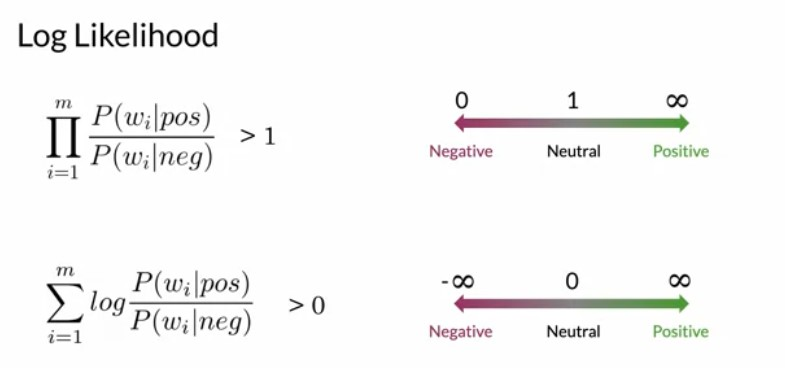

### Train Naive Bayes

The steps involved in training a Naive Bayes model can be summarized as -

- Collect and Annotate Corpus into Positive and Negative Tweets
- Preprocessing of Tweets
  - Lowercase and Removing Punctuation, URLs, Handles
  - Removing Stopwords
  - Stemming
  - Tokenise Sentences
- Construct a frequency table i.e. each word in the positive or negative context

  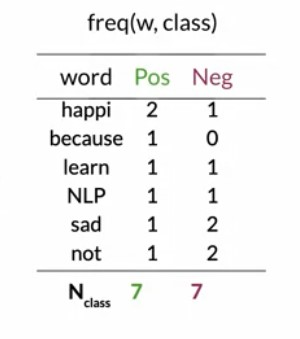

- Compute the conditional probabiliies and apply Laplacian Smoothing. Also compute the log likelihood.

  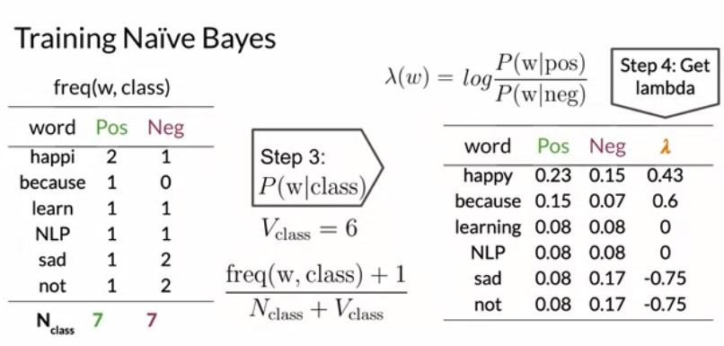

- Compute the log prior if necessary

  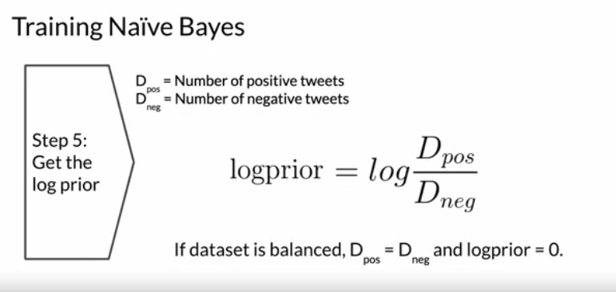

### Test Naive Bayes

- To test the accuracy of the Naive Bayes model, we use the log-likelihood dictionary computed from the training process on the specific corpus.
- To find the sentiment of the sentence, we simply add the log likelihoods and the log prior if present and find the sentiment. If calculated > 0, sentiment is positive else sentiment is negative.
- To compute the final accuracy of the model, we compare the array of the predicted outputs and the actual outputs of the validation set.

### Applications of Naive Bayes

Naive Bayes can be used in a variety of applications in NLP:

- To find out who is the author of a specific text using a similar process.
- To find out whether a mail is spam or not
- To speed up information retrieval by computing the likelihood of a document based on the words in the document.
- To disambiguate words on the basis of context of the words.

### Naive Bayes Assumptions

- Naive Bayes is a very simple model because it doesn't require setting any custom parameters.
- This method is referred to as naive because of the assumptions it makes about the data.
  - The first assumption is independence between the predictors or features associated with each class and the second has to do with your validation sets. The following sentence illustrates the independence between features : It is sunny and hot in the Sahara Desert.
  - Words are often related to each other in a particular sentence. Hot and Sunny will appear together while describing a beach or a desert. In these cases, the model might under or overestimate the conditional probabilities of the words.
  - Its always cold and snowy in \_\_ ; all the seasons would be weighed similarly in the blank here.
  - Another Assumption is the relative frequencies in corpus. Most annotated corpora are artificially balanced which is not the case in the real world. Positive and Negative Tweets could be not balanced.

### Error Analysis

Errors might occur due to various reasons, some of which are highlighted below:

- Spelling mistakes and punctuation, along with smilies
- Removing stopwords which are necessary
- Differences in ordering or words i.e Sequence
  - I am happy because I did not go = **positive sentiment**
  - I am not happy because I did go = **negative sentiment**
- Adversarial attacks such as sarcasm, irony and euphemisms
