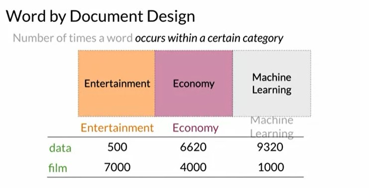
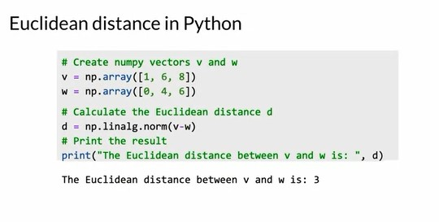

## Week 3 - Word Embeddings

### Vector Space Models

- Vector space models are an important idea in both supervised Machine Learning and Natural Language Processing.
- Suppose you have two sentences which contain identical parts, but completely different meaning.
  - **Where are you** heading?
  - **Where are you** from?
- Whereas we can have sentences which have the same meaning but are completely dissimilar
  - What is your age?
  - How old are you?
- Vector space models help us identify similarity of the words and capture the relationship between neighbouring words for applications such as question answering, paraphrasing and summarization.

  

### Word by Word and Word by Doc

- Vectors can be constructed based off a co-occurence matrix with two possible designs, either encoding a word or document as a vector.
- To make a vector space model using a word by word design, you have to make a co-occurence matrix and extract the vector representations for the words in the corpus.

### Euclidean Distance

- Euclidean distance is the straight line distance connecting two document vectors in an n-dimensional space.

  
  
  

### Cosine Similarity

- Cosine Similarity is another similarity metric which uses the cosine angle between the two document vectors in an n-dimensional space.
- It takes into account the bias caused due to the varying sizes of corpus. As shown in the image below

  - The euclidean distance suggests that Agriculture and History Corpus are more similar than the Agriculture and Food Corpus (d2>d1)
  - The cosine angle shows the actual similarity. The angle made between A and H is (b) and the angle made between A and F is (a). (a)<(b) which suggests the Agriculture and Food Corpus are more similar in nature.

  
  
  

### Manipulate Words in Vector Spaces

- Words in the vector spaces can be manipulated by simple linear algebra. Vector operations such as addition and subtraction can allow us to predict similar words.
- Consider a corpus which contains the names of the countries and their capitals.
  

- The distance between the first country and capital is observed in terms of vectors.
- This vector can be subtracted from the subsequent countries and the closest capitals can be assigned.

### Visualization and PCA

- There is a possibility that the vectors from the word embeddings can reach very high dimensions due to the large size of the corpus. To reduce the dimensions in order to fit them in a graph (X-Y), we use Principal Component Analysis.
- This reduced representation can help us to identify relationship between words in the vocabulary with the help of visualization.
  

- Consider a 2-D representation for understanding PCA. We find a set of uncorrelated features and then project this data to a 1-D space while retaining as much information as possible.

### Principal Component Analysis in brief

- From the original vector space, we have to get a set of uncorrelated features and then project this data into n-dimensions where n is the desired number of features.

  

- **Eigenvector** : uncorrelated features for your data
- **Eigenvalues** : the amount of info retained by each feature

  
  

- So to perform PCA, you will need to get the eigenvectors and eigenvalues from the covariance matrix of your data.

  - The first step is to get a set of uncorrelated features. For this step, you will mean normalize your data, then get the covariance matrix, and finally, perform a singular value decomposition to get a set of three matrices.
  - The first of those matrices contain the eigenvector stacked column wise. And the second one has the eigenvalues on the diagonal.
  - The singular vector decomposition is already implemented in many programming libraries. The next step is to project your data to a new set of features.
  - You will be using the eigenvectors and eigenvalues in this step. Let's denote the eigenvectors with U, and the eigenvalues with S. First, you will perform the dot products between the matrix containing your word embeddings and the first and columns of the U Matrix, where n equals the number of dimensions that you want to have at the end.
  - For visualization, it's common practice to have two dimensions. Then you will get the percentage of variance retained in the new vector space.
  - As an important side note, your eigenvectors and eigenvalues should be organized according to the eigenvalues in descending order. This condition will ensure that you retain as much information as possible from your original embedding. However, most libraries order those matrices for you.

- Eigenvectors from the covariance matrix of your normalized data give the directions of uncorrelated features. The eigenvalues associated with those eigenvectors tell you the variance of your data on those features. The dot products between your word embeddings and the matrix of eigenvectors will project your data onto a new vector space of the dimension that you choose.
