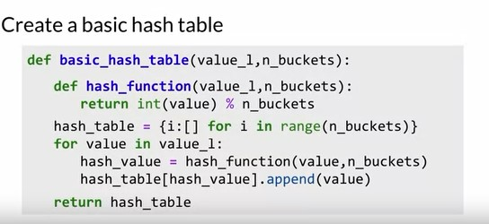

## Week 4 - Machine Translation and Similar Sentences

### Transforming Word Vectors

- For translation of one language to another, one approach would be to have an extensive list of the English words and their French equivalents respectively.
- But for the machines to translate, it is easier to convert a word vector/embedding from the vector space of the English language and transform the vector such that it matches a similar word in the vector space of the French language.
- Transforming the vectors involves calulating the dot product of a matrix R and a vector X which results in a vector Y with same dimensions as X.

  

- This transformation matrix R has to be computed by minimizing the distance between the vector spaces X and Y. This matrix R will help us in translating English into French even if we have a small set of words on the either side. This minimization is done using Frobenius Normalization.
- Solving for R, we first have to find the loss.

  

- The Frobenius Norm is calculated in the following manner
  

  

### K-Nearest Neigbours

- K-nearest neigbours is a basic building block in many supervised Machine Learning applications. One the transformation matrix has been used to convert an English word vector into French word vector, it cannot be directly matched to any French word.
- We have to find a similar word to the new vector in the French vector space.

  

- Nearest Neigbours can narrow down the possibilities of the similar words into a smaller set of the vocabulary (vector space) instead of searching the whole space.

### Hash tables and Hash functions

- Hash tables and functions are essential parts in arranging word vectors. Hashing can be visualised as putting categorising shapes into buckets according to the sides they have.
- To create a basic hash table in Python, we can use the code below:

  

### Locality sensitive hashing

- **Locality sensitive hashing** is one of the key methods in order to reduce the computational cost of finding the k-nearest neighbours in high dimensional spaces.
- Planes in the vector space can help us bucket the vectors into subsets based on their location which results in a hashing function that is sensitive to the location of the items that it's assigning into buckets.

  

- **Why planes?**

  - In 2-D space, planes can be visualised as a single line. The line perpendicular to the previous line is it's normal vector.
  - Planes are useful in deciding where to put specific vectors as you can place the vector on either side of the plane.
  - To find out the side of the plane that the vector lies on, you need to find the dot product of the vectors which helps us in assigning the vector.

  

### Multiple Planes

- Information from Multiple planes can be combined into to single hash value, to make the vector space more uniform and manageable.
- Each plane will have a positive and negative side, and we position the specific vector inside these planes.

  
  
  

### Approximating Nearest Neighbors

- Instead of brute forcing through the whole vector space, we can divide the vector space into random planes because there are no great or fixed number of planes to divide a specific vector space.
- These planes help us in placing these vectors by approximating the nearest neighbours and thereby helping us in finding the translated word more efficiently.

  

### Searching Documents

- Represent the documents as vectors by adding the individual word vectors to get the document embedding
- This helps us applying the k-nn algorithm to the whole document.
